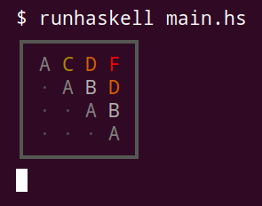

Haskelletters
=============



This is an interactive puzzle game with similar mechanics to 
[Threes](http://play.threesgame.com/), [1024](https://1024game.org/),
[2048](https://play2048.co/), etc. I wrote it as a first attempt at learning
Haskell, so it's pretty basic (and also probably not as idiomatic as it might 
be). It will look best on a terminal with a dark background that supports 
unicode and 256 colors.

Each turn, an A or B will be added to an empty space on the board, and you 
can use the arrow keys to slide all tiles to the left, right, top, or bottom.
When two tiles with the same letter collide, they combine to form the next 
letter in the alphabet, so two As make a B, two Bs make a C, two Cs make a D, 
and so on. If you get an L on the board, you win, but if the board fills up
with letters before then, you lose. You can quit by pressing "q" or just 
Ctrl+C.

Running
=======

I haven't made a distribution build, but it can be run using `runhaskell`:

```
$ runhaskell main.hs
```
